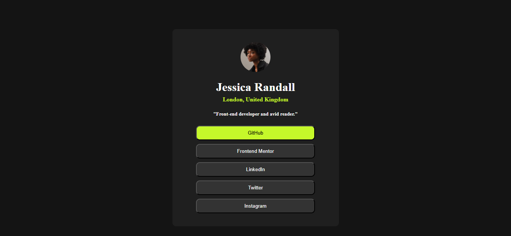

# Frontend Mentor - Social links profile solution

This is a solution to the [Social links profile challenge on Frontend Mentor](https://www.frontendmentor.io/challenges/social-links-profile-UG32l9m6dQ). Frontend Mentor challenges help you improve your coding skills by building realistic projects. 

## Table of contents

- [Overview](#overview)
  - [The challenge](#the-challenge)
  - [Screenshot](#screenshot)
- [My process](#my-process)
  - [Built with](#built-with)
  - [What I learned](#what-i-learned)
  - [Continued development](#continued-development)
- [Author](#author)

## Overview

### The challenge

Users should be able to:

- See hover and focus states for all interactive elements on the page

### Screenshot



## My process

### Built with

- Semantic HTML5 markup
- CSS custom properties
- Flexbox
- CSS transitions and hover effects
- Mobile-first workflow

### What I learned

During this project, I strengthened my understanding of CSS Flexbox for centering content and creating responsive layouts. I also practiced implementing smooth hover transitions for interactive elements.

One key learning was creating different button states - having the GitHub button highlighted by default while maintaining consistent hover effects across all buttons:

```css
.but:hover {
    color: hsl(0, 0%, 3%);
    background-color: hsl(75, 94%, 57%);
}
```

I also learned how to properly structure a profile card with centered content using Flexbox:

```css
.card {
   background-color: hsl(0, 0%, 12%);
   display: flex;
   align-items: center;
   justify-content: center;
   flex-direction: column;
   border-radius: 10px;
}
```

### Continued development

In future projects, I want to focus on:

- Improving accessibility by adding proper ARIA labels and keyboard navigation
- Making the design more responsive across different screen sizes
- Adding more sophisticated animations and transitions
- Exploring CSS Grid alongside Flexbox for more complex layouts

## Author

- Frontend Mentor - [@grestudio](https://www.frontendmentor.io/profile/greystudio)
- Twitter - [@greythedev]https://x.com/greythedev